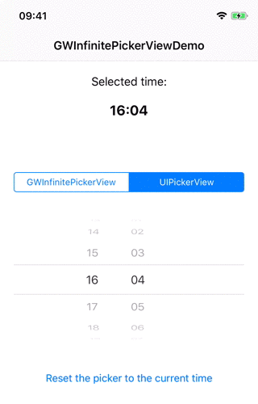
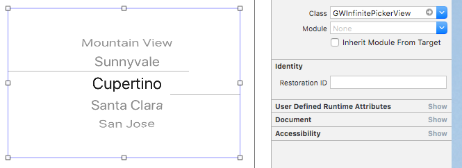

[](https://cocoapods.org/pods/GWInfinitePickerView)
[](https://github.com/Carthage/Carthage)
[](https://travis-ci.org/gwikiera/GWInfinitePickerView)

# GWInfinitePickerView

The GWInfinitePickerView is an extension of the UIPickerView which makes it endless (like UIDatePicker).




## Usage

The `GWInfinitePickerView` inherited from `UIPickerView`, so all you have to do is just change the class of your picker view to the GWInfinitePickerView. All the magic is under the hood, outside it seems to be normal `UIPickerView`, so you don't have to change your existing `UIPickerView`, `UIPickerViewDataSource` and `UIPickerViewDelegate` implementation. 

```swift
let dataSource: UIPickerViewDelegate = ...
let delegate: UIPickerViewDelegate = ...

// Instead of UIPickerView
// let pickerView = UIPickerView()
// just create GWInfinitePickerView
// GWInfinitePickerView
let pickerView = GWInfinitePickerView()

// and then assign dataSource and delegate as usuall
pickerView.dataSource = dataSource
pickerView.delegate = delegate
```

Or you can set up it in Interface Builder:



## Installation

### CocoaPods

`GWInfinitePickerView` is available through [CocoaPods](http://cocoapods.org). To install
it, simply add the following line to your Podfile:

```bash
pod "GWInfinitePickerView"
```

### Carthage

To integrate `GWInfinitePickerView` into your Xcode project using [Carthage](https://github.com/Carthage/Carthage), specify it in your `Cartfile`:

```ogdl
github "gwikiera/GWInfinitePickerView" ~> 0.3.0
```

## Author

Grzegorz Wikiera, gwikiera@gmail.com

## License

GWInfinitePickerView is available under the MIT license. See the LICENSE file for more info.
